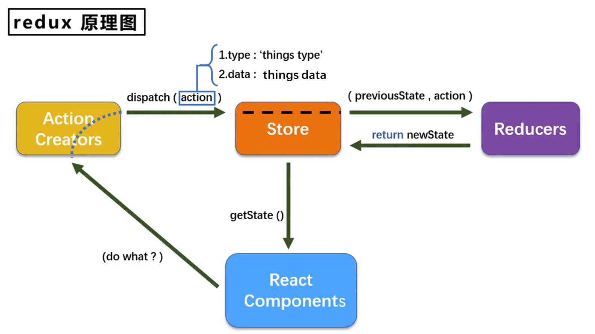
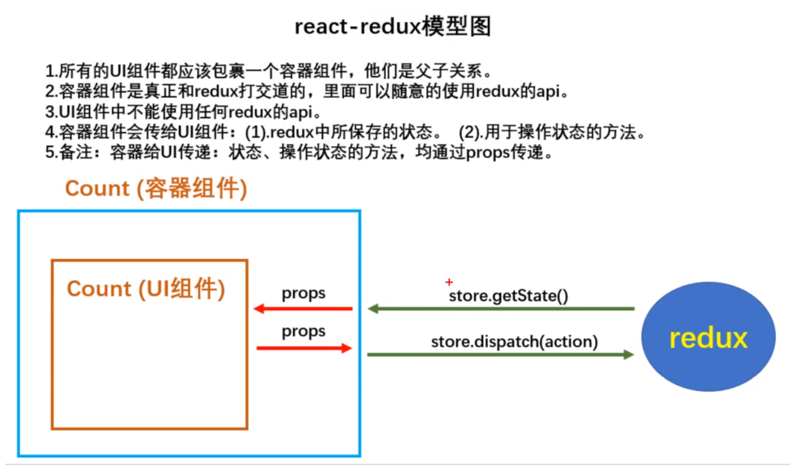

---
categories:
    - React
tags:
    - React
    - 学习笔记
---

# React学习笔记

1. 在html中简易使用jsx语法时，需要引入babel插件，同时设置`<script type="text/babel"></script>`
2. js语法创建虚拟DOM：`React.createElement('h1', {id: 'test'}, 'Hello, React')`
3. 关于虚拟DOM：
   1. 本质就是Object类型的对象
   2. 虚拟DOM是React内部用，无需真实DOM上那么多属性
   3. 虚拟DOM最终会被转换为真实DOM
4. JSX语法规则：
   1. 定义虚拟DOM时，不要加引号，如`<h1>我是虚拟DOM</h1>`
   2. 标签中混入**js表达式**时需要用`{}`
   3. 添加类名时需要用小驼峰`className`，不要用`class`
   4. 使用内联样式`style`时，需要使用`{{}}`，里边的`{}`表示对象。如`{{color: 'red'; fontSize: 'px'}}`，里边的属性需要使用小驼峰替代`-`的写法
   5. 只能有一个跟标签
   6. 标签必须闭合
   7. 标签的首字母：
      1. 如果是小写字母开头，则将标签转为html中同名标签，如果html中没有对应标签，则报错
      2. 如果是大写字母开头，react就去渲染对应组件，若组件未定义，则报错
5. js语句（代码）与js表达式
   1. js语句：
      1. `if () {}`
      2. `for () {}`
      3. `switch () {}`
      4. ...
   2. js表达式
      1. `a`
      2. `a+b`
      3. `arr.map()`
      4. `function test () {}`
   3. 总结：js表达式有返回值，能直接赋值给变量
6. 函数定义的组件：执行`ReactDOM.render(<MyComponent />, ...)`之后发生了什么？
   1. React解析组件标签，找到了`MyComponent`组件
   2. 发现组件使用函数定义，随后调用该函数，将返回的虚拟DOM转为真实DOM，随后呈现在页面中
7. 类定义的组件：执行`ReactDOM.render(<MyComponent />, ...)`之后发生了什么？
   1. React解析组件标签，找到了`MyComponent`组件
   2. 发现组件使用类定义，随后`new`出来该类的实例，并通过实例调用原型上的`render()`方法
   3. 将render返回的虚拟DOM转为真实DOM，随后呈现在页面中
8. 组件`实例`的三大核心属性：
   1. `state`:
      1. 初始化状态（不用构造器）：`state = {}`
      2. 不可直接更改，需要借助内置的API：`setState({})`
   2. `props`
      1. 批量传递标签属性：`{...p}`
      2.对props进行限制：
      ```jsx
        // prop-types.js
        static propTypes = {
           name: PropTypes.string.isRequired,
           age: PropTypes.number,
           fun: PropTypes.func
        }
        static defaultProps = {
           age: 18
        }

      ```
      3. props是只读的，不能更改
      4. 构造器是否接受`props`,是否传给`super`,取决于：是否希望在构造器中通过`this`访问`props`
   3. `refs`
      1. 字符串形式的`ref`：`<input ref='input1' />` (效率不高，不推荐，可能废弃)
      2. 回调函数形式`ref`：`<input ref={(currentNode) => {this.input1 = currentNode}}/>`
         - 回调函数执行次数问题
            - 内联函数：更新过程会被执行两次, 第一次传参`null`, 第二次传参`DOM元素`, 这是因为在每次渲染时会创建一个新的函数实例，所以 React 清空旧的 ref 并且设置新的
            - class的绑定函数可以避免上述问题
            ```jsx
               func = c => {
                  this.input1 = c;
               }
               `<input ref={this.func} />`
            ```
      3. `createRef`
      ```js
         // React.createRef调用后可以返回一个容器，该容器可以存储被ref所标识的节点，该容器是“专人专用”的
         myRef = React.createRef()
         showData = () => {
            console.log(this.myRef.current.value);
         }
      ```
9. 展开运算符: `...`常用的几种用法
   1. 在数组中使用
   ```js
      let arr1 = [1, 2, 3];
      let arr2 = [4, 5, 6];
      let arr3 = [...arr1, ...arr2]; // 连接数组 [1, 2, 3, 4, 5, 6]
   ```
   2. 在函数中使用
   ```js
      function sum(...numbers) {
         return numbers.reduce((preValue, currentValue) => {
            return preValue + currentValue;
         });
      }
   ```
   3. 构造字面量对象时使用展开语法
   ```js
      let person = {name: 'tom', age: 19};
      let person2 = {...person};
      // console.log(...person); // 报错，展开运算符不能展开对象
      person.name = 'jerry';
      console.log(person2); // {name: 'tom', age: 19}
      console.log(person); // {name: 'jerry', age: 19}

      // 合并
      let person3 = {...person, name: 'jack', address: '地球'};
      console.log(person3); // {name: 'jack', age: 19, address: '地球'}
   ```
10. React中的事件处理
   - 通过onXxx属性指定事件处理函数（注意大小写）
      - React使用的是自定义（合成）事件，而不是使用的原生DOM事件————为了更好的兼容性
      - React中的事件是通过事件委托方式处理的（委托给组件最外层的元素）————为了更高效
   - 通过event.target得到发生事件的DOM元素对象————不要过渡的使用ref
   ```js
      showData = event => {
         console.log(event.target.value);
      }
      <input onBlur={this.showData} />
   ```
11. 受控组件和非受控组件
- 非受控组件：现用现取
- 受控组件：随着输入维护状态(State)--推荐

12. 高阶函数和函数柯里化
- 高阶函数：如果一个函数符合下面2个规范中的任何一个，那该函数就是高阶函数
   - 若A函数接收的`参数是一个函数`，那么A就可以称为高阶函数
   - 若A函数，调用的`返回值依然是一个函数`，那么A就可以称为高阶函数
   - 常见的高阶函数：`Promise`,`setTimeout`,`arr.map()`
```js
// 柯里化方式
handleFormData(dataType) {
   return (event) => {
      this.setState({
         [dataType]: event.target.value
      })
   }
}

<input onChange={this.handleFormData('username')} type="text" name="username"/>
<input onChange={this.handleFormData('password')} type="password" name="password"/>

// 非柯里化方式
handleFormData(dataType, event) {
   this.setState({
      [dataType]: event.target.value
   })
}

<input onChange={event => this.handleFormData('username', event)} type="text" name="username"/>
<input onChange={event => this.handleFormData('password', event)} type="password" name="password"/>
```

- 函数的柯里化：通过函数调用继续返回函数的方式，实现多次接收参数最后统一处理的函数编码形式

13. React的生命周期

生命周期回调函数 <=> 生命周期钩子函数 <=> 生命周期函数 <=> 生命周期钩子

**卸载组件：**
`React.unmountComponentAtNode(document.getElementById('root'))`


- 初始化阶段：由`React.render()`触发---初次渲染
  - `constructor()`
  - `componentWillMount()`
  - `render()`
  - `componentDidMount()`===>常用：一般在这个钩子中做一些初始化的事，例如：开启定时器、订阅消息、发送网络请求
- 更新阶段：由组件内部`this.setState()`或`父组件render`触发
  - `shouldComponentUpdate()`
  - `componentWillUpdate()`
  - `render()`===>必须使用
  - `componentDidUpdate()`
- 卸载阶段：由`React.unmountComponentAtNode()`触发
  - `componentWillUnmount()`===>常用：一般在这个钩子中做一些收尾的事，例如：关闭定时器、取消订阅


- 初始化阶段：由`React.render()`触发---初次渲染
  - `constructor()`
  - `getDerivedStateFromProps()`
  - `render()`
  - `componentDidMount()`===>常用：一般在这个钩子中做一些初始化的事，例如：开启定时器、订阅消息、发送网络请求
- 更新阶段：由组件内部`this.setState()`或`父组件render`触发
  - `shouldComponentUpdate()`
  - `getDerivedStateFromProps()`
  - `render()`===>必须使用
  - `getSnapshotBeforeUpdate()`
  - `componentDidUpdate()`
- 卸载阶段：由`React.unmountComponentAtNode()`触发
  - `componentWillUnmount()`===>常用：一般在这个钩子中做一些收尾的事，例如：关闭定时器、取消订阅

14. DOM的Diffing算法

经典面试题：
   1. React/Vue中的key有什么作用？（key的内部原理是什么？）
   2. 为什么遍历时，key最好不用index？

- 虚拟DOM中key的作用：
  - 简单地说：key是虚拟DOM的标识，在更新显示时key起着极其重要的作用
  - 详细的说：当状态中的数据发生变化时，React会根据【新数据】生成【新的虚拟DOM】，随后React进行【新虚拟DOM】与【旧虚拟DOM】的diff比较，比较规则如下：
    - 旧虚拟DOM中找到了与新虚拟DOM相同的key：
      - 若虚拟DOM中内容没变，则使用之前的真实DOM
      - 若虚拟DOM中内容变了，则生成新的真实DOM，随后替换掉页面中之前的真实DOM
    - 旧虚拟DOM中没有找到与新虚拟DOM相同的key：
      - 根据数据创建新的真实DOM，随后渲染到页面中
- 用index作为key可能会引发的问题：
  - 若对数据进行：逆序添加、逆序删除等破坏顺序的操作：会产生不必要的真实DOM更新===>界面效果没问题，但效率低
  - 如果结构中还包含输入类的DOM：会产生错误的DOM更新===>界面有问题
  - 注意，如果不存在数据的逆序添加、逆序删除等破坏顺序的操作，仅用于显示列表用于展示，使用index作为key是没有问题的
- 开发中如何选择key？
  - 最好使用每条数据的唯一标识作为key，比如id、手机号、身份证号、学号等唯一标识
  - 如果确定只是简单的展示数据，用index也是可以的

15. 安装React脚手架：`npm install -g create-react-app`

16. `uuid`和`nanoid`库，用于生成唯一的ID值

17.  todoList案例相关知识点：
     1.   拆分组件、实现静态组件，注意：`className`、`style`的写法
     2.   动态初始化列表，如果确定将数据放在哪个组件的`state`中?
          1.   某个组件使用：放在其自身的`state`中
          2.   某些组件使用：放在他们共同的父组件`state`中（官方称为：状态提升）
     3.   关于父子组件之间通信：
          1.   父组件给子组件传递数据：通过`props`传递
          2.   子组件给父组件传递数据：通过`props`传递，要求父组件提前给子组件传递一个函数
     4.   注意`defaultChecked`和`checked`的区别，类似的还有`defaultValue`和`value`：`default`开头的只在初次渲染起作用。
     5.   状态在哪里，操作状态的方法就在哪里

18. `axios`
    1.  封装`XmlHttpRequest`对象的`ajax`
    2.  `promise`风格
    3.  可以在浏览器端和node服务端使用

19. React配置代理
    1.  方式一:
         ```js
         // package.json
         "proxy": "http://localhost:5000"  // 3000端口没有的才转发给5000
         ```
    2. 方式二：

         ```js
            // src/setupProxy.js
            // common js
            const proxy = require('http-proxy-middleware')

            module.exports = function(app) {
               app.use(
                  proxy(/api1, {
                     target: 'http://localhost:5000',
                     changeOrigin: true, // 控制服务器收到的请求头中Host字段的值
                     pathRewrite: {'^/api1': ''}
                  }),
                  proxy(/api2, {
                     target: 'http://localhost:5001',
                     changeOrigin: true,
                     pathRewrite: {'^/api2': ''}
                  })
               )
            }
         ```

20. 连续解构赋值

```js
let obj  = {a: {b: {c: 1}}};
const {a:{b:{c}}} = obj; // c: 1

// 同时重命名
const {a:{b:{c:data}}} = obj; // data: 1
```

21. 消息订阅与发布机制：`PubSubJS`
    1.  `npm install pubsub-js`
    2.  `import PubSub from 'pubsub-js'`
    3.  订阅消息`let token = PubSub.subscribe('msgName', (data) => {...})`
    4.  发布消息`PubSub.publish('msgName', data)`
    5.  取消订阅`PubSub.unsubscribe(token)`

22. `Fetch`:原生函数，不再使用`XmlHttpRequest`对象提交`ajax`请求，老版本浏览器可能不支持（关注分离的设计思想）

23. React路由：
    1.  `react-router-dom`
    2.  明确好界面的导航区和展示区
    3.  导航区的a标签改为`<Link to="/xxx">Demo</Link>`,`<NavLink activeClassName={active-style}></NavLink>`
    4.  展示区写`Route`标签进行路径匹配:`<Route path="/xxx' component={Demo} />`
    5.  在`<App />`的最外侧包裹`<BrowserRouter>`或`<HashRouter>`

24. 一般组件和路由组件
    1.  写法不同：
        1.  一般组件：`<Demo />`
        2.  路由组件：`<Route path="/demo" component={Demo}>`
    2.  存放位置不同
        1.  一般组件：`components`
        2.  路由组件：`pages`
    3.  接收到的`props`不同
        1.  一般组件：写组件标签时传递了什么，就能收到什么
        2.  路由组件：接收到三个固定的属性
            ```
            history:
               go: f go(n)
               goBack: f goBack()
               goForward: f goForWard()
               push: f push(path, state)
               replace: f replace(path, state)
            
            location: 
               pathname: "/about"
               search: ""
               state: undefined
            
            match: 
               params: {}
               path: "/about"
               url: "/about"
            ```

25. 解决多级路径刷新页面样式丢失问题
    1.  public/index.html中引入样式不用相对路径`./`,而是用绝对路径`/`（常用）
    2.  public/index.html中引入样式用`%PUBLIC_URL%`(常用)
    3.  使用`HashRouter`

26. `<Switch></Switch>`解决路由多次匹配问题（单一匹配，提高效率）

27. 封装`<MyNavLink></MyNavLink>`: `this.props.children`,`{...props}`

28. 路由的模糊匹配和严格匹配（`exact`）
    1. 默认使用模糊匹配（输入的路径和必须包含匹配的路径，且顺序要一致）
    2. 开启严格匹配`<Route exact path="/demo" component={Demo} />`
    3. 严格模式不要随便开启，需要再开启，有些时候开启会导致无法继续匹配二级路由

29. `<Redirect>`的使用
    1.  一般卸载所有路由注册的最下方，当所有路由都无法匹配时，跳转到Redirect指定的路由
    2.  
```js
   <Switch>
      <Route path="/about" components={About} />
      <Route path="/home" components={Home} />
      <Redirect to="/about" />
   </Switch>
```

30. 嵌套路由
- 注册子路由时要写上父路由的`path`
- 路由的匹配是按照路由注册的顺序进行的

31. 向路由组件传递参数
    1.  `params`参数
        1.  路由链接（携带参数）：`<Link to="/demo/test/tom/18">详情</Link>`
        2.  注册路由（声明接收）：`<Route path="/demo/test/:name/:age" component={Test}>`
        3.  接收参数：`const {name, age} = this.props.match.params`
    2.  `search`参数
        1.  路由链接（携带参数）：`<Link to="/demo/test?name=tom&age=18">详情</Link>`
        2.  注册路由（无需声明，正常注册即可）：`<Route path="/demo/test" component={Test} />`
        3.  接收参数：`const {search} = this.props.location`
        4.  获取到的`search`是`urlencoded`编码字符串，需要借助`querystring`解析
            ```js
               import qs from 'querystring'
               let {name, age} = qs.parse(search.slice(1)) // search.slice(1) 是为了去掉开头的 ?
            ```
    3.  `state`参数
        1.  路由链接（携带参数）：`<Link to={{path: '/demo/test', state: {name: 'tom', age: 18}}}>详情</Link>`
        2.  注册路由（无需声明，正常注册即可）：`<Route path="/demo/test" component={Test} />`
        3.  接收参数：`this.props.location.state`
        4.  备注：刷新也可以保留住参数

32. `push`和`replace`

33. 编程式路由导航

借助`this.props.history`对象上的API对操作路由跳转、前进、后退

- `this.props.history push()`
- `this.props.history.replace()`
- `this.props.history.goBack()`
- `this.props.history.goForward()`
- `this.props.history.go()`

34. `withRouter`

```js
import {withRouter} from 'react-router-dom'

class Demo extends ...

export default withRouter(Demo)

// withRouter可以加工一般组件，让一般组件具备路由组件所特有的API
// withRouter的返回值是一个新组件
```

35. `BrowserRouter`与`HashRouter`的区别
    1.  底层原理不一样：
        1.  `BrowserRouter`使用的是H5的history API，不兼容IE9以下版本。
        2.  `HashRouter`使用的是URL的哈希值
    2.  path表现形式不一样
        1.  `BrowserRouter`的路径中没有`#`，例如：`localhost:3000/demo/test`
        2.  `HashRouter`的路径中包含`#`，例如：`localhost:3000/#/demo/test`
    3.  刷新后对路由`state`参数的影响
        1.  `BrowserRouter`没有任何影响，因为state保存在history对象中。
        2.  `HashRouter`刷新后会导致路由state参数的丢失。
    4.  备注：`HashRouter`可以用于解决一些路径错误相关的问题。

36. `antd`的按需引入+自定义主题
    1.  安装依赖：`yarn add react-app-rewired customize-cra babel-plugin-import less less-loader`
    2.  修改`package.json`

         ```json
            ...
            "scripts": {
               "start": "react-app-rewired start",
               "build": "react-app-rewired build",
               "test": "react-app-rewired test",
               "eject": "react-scripts eject"
            },
            ...
         ```
    3. 根目录下创建`config-overrides.js`

         ```js
            // 配置具体的修改规则
            const { override, fixBabelImports, addLessLoader } = require('customize-cra');

            module.exports = override(
               fixBabelImports('import', {
                  libraryName: 'antd',
                  libraryDirectory: 'es',
                  style: true,
               }),
               addLessLoader({
                  lessOptions: {
                     javascriptEnabled: true,
                     modifyVars: { '@primary-color': 'green' },
                  }
               })
            )
         ```
    4. 备注：不用在组件里亲自引入样式了，即：`import 'antd/dist/antd.css`应该删掉

## `Redux`

`redux`是一个专门用于做状态管理的JS库（不是react插件库）

作用：集中式管理react应用中多个组件**共享**的状态

**什么情况下需要使用redux**

- 某个组件的状态，需要让其他组件可以随时拿到（共享）。
- 一个组件需要改变另一个组件的状态（通信）。
- 总体原则：能不用就不用，如果不用比较吃力才考虑使用。

**Redux原理图**



### redux的三个核心概念

1. `action`
   1. 动作的对象
   2. 包含2个属性
      1. type：标识属性，值为字符串，唯一，必要属性
      2. data：数据属性，值类型任意，可选属性
   3. 例子：`{type: 'ADD_STUDENT', data: { name: 'tom', age: 18 }}`

2. `reducer`
   1. 用于初始化状态、加工状态
   2. 加工时，根据旧的`state`和`action`，产生新的`state`的`纯函数`

3. `store`
   1. 将`state`、`action`、`reducer`联系在一起的对象
   2. 如何得到此对象？
      1. `import {createStore} from 'redux'`
      2. `import reducer from './reducers'`
      3. `const store = createStore(reducer)`
   3. 此对象的功能？
      1. `getState()`：得到state
      2. `dispatch(action)`：分发action，触发reducer调用，产生新的state
      3. `subscribe(listener)`：注册监听，当产生了新的state时，自动调用

### 项目简单应用

1. 去除组件自身需要共享的状态
2. 建立文件夹和文件

```js
-src
--redux
---store.js
---count_reducer.js
---constant.js
---count_action.js
```
3. `store.js`

```js
import { createStore } from 'redux'
import countReducer from './count_reducer'
export default createStore(countReducer)
```

4. `count_reducer.js`

```js
import { INCREMENT, DECREMENT } from './constant'

const initPreState = 0
export default function countReducer(preState=initPreState, action) {
   const { type, data } = action
   switch(type) {
      case INCREMENT:
         return preState + data
      case DECREMENT:
         return preState - data
      default:
         return preState
   }
}
```

5. 在`index.js`中检测store中状态的改变，一旦发生改变重新渲染`<App />`

备注：redux只负责管理状态，至于状态的改变驱动着页面的展示，需要自己写。

```js
import React from 'react'
import ReactDOM from 'react-dom'
import store from 'redux'

ReactDOM.render(<App />, document.getElementById('root'))

store.subscribe(() => {
   ReactDOM.render(<App />, document.getElementById('root'))
})
```

6.  `count_action.js`

```js
// 专门用于创建action对象
import { INCREMENT, DECREMENT } from './constant'
export const createIncrementAction = data => ({type: INCREMENT, data})
export const createDecrementAction = data => ({type: DECREMENT, data})
```

7. `constant.js`

```js
// 定义action对象中type类型的常量值
export const INCREMENT = 'increment'
export const DECREMENT = 'decrement'
```

### `Action`类型

- 同步`action：Object`

- 异步`action：Function`

异步action使用：

1. 明确：延迟的动作不想交给组件自身，想交给action
2. 何时需要异步action：想要对状态进行操作，但是具体的数据靠异步任务返回（非必须)
3. 创建action的函数不再返回一般对象，而是返回一个函数，该函数中写异步任务
4. 异步action不是必须要写的，完全可以自己等待异步任务的结果后再去分发同步action
5. 具体编码

```js
// 安装redux-thunk，并配置在store中
// yarn add redux-thunk
// store.js
import { createStore, applyMiddleware } from 'redux'
import countReducer from './count_reducer'
import thunk from 'redux-thunk'

export default createStore(countReducer, applyMiddleware(thunk))

// count_action.js
// 同步action
export const createIncrementAction = data => ({type: INCREMENT, data})
// 异步action
export const createIncrementAsyncAction = (data, time) = {
   return (dispatch) => {
      setTimeout(() => {
         dispatch(createIncrementAction(data))
      },time)
   } 
}
```

### `react-redux`



```js
// 安装react-redux
// yarn add react-redux
// 创建容器组件

// src/containers/Count/index.jsx

// 引入Count的UI组件
import CountUI from '../../components/Count'
import {createIncrementAction, createDecrementAction, createIncrementAsyncAction} from '../../redux/count_action'
// 引入connect用于连接UI组件与redux
import {connect} from 'react-redux'

/*
   1.mapStateToProps函数返回一个对象
   2.返回的对象中的key就作为传递给UI组件props的key，value就作为传递给UI组件props的value
   3.mapStateToProps用于传递状态
*/
function mapStateToProps(state) {
   return {count: state}
}

/*
   1.mapDispatchToProps函数返回的是一个对象
   2.返回的对象中的key就作为传递给UI组件props的key，value就作为传递给UI组件props的value
   3.mapDispatchToProps用于传递操作状态的方法
*/
function mapDispatchToProps(dispatch) {
   return {
      increment: number => dispatch(createIncrementAction(number)),
      decrement: number => dispatch(createDecrementAction(number)),
      incrementAsync: number => dispatch(createIncrementAsyncAction(number))
   }
}

// 使用connect()()创建并暴露一个Count的容器组件
export default connect(mapStateToProps, mapDispatchToProps)(CountUI)
```

### 容器组件优化

```js
// src/containers/Count/index.jsx
import { connect } from 'react-redux'
import CountUI from '../../components/Count'
import {createIncrementAction, createDecrementAction, createIncrementAsyncAction} from '../../redux/count_action'

export default connect(
   state => ({ count: state }),
   {
      increment: createIncrementAction,
      decrement: createDecrementAction,
      incrementAsync: createIncrementAsyncAction,
   }
)(CountUI)
```