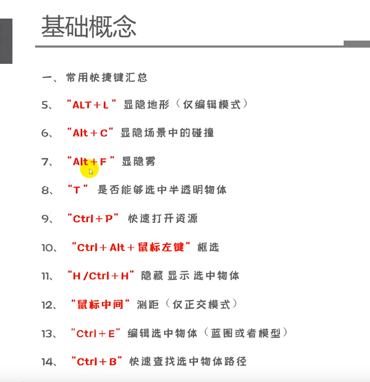
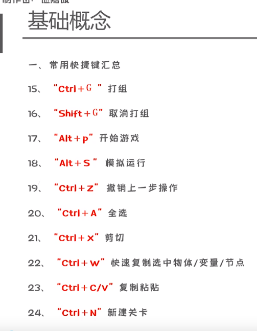
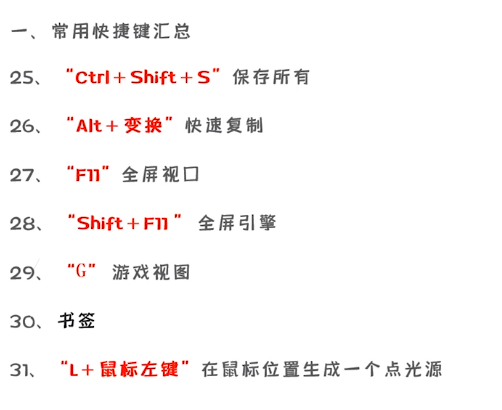
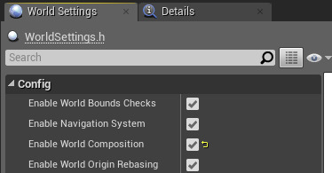

---
categories:
    - UE4
tags:
    - UE4
    - 学习笔记
---

# UE4学习笔记

1. 常用快捷键

2. 变更路线节点：`Reroute Node`

3. `Execute Console Command`命令
   1. 设置分辨率`r.setRes 1920x1080`

## UE4像素流送系统

### 特点：

1. 流送并非播放预先录制的视频片段，而是播放虚幻引擎实时生成的渲染帧和音频。
2. 用户可通过自己的浏览器对体验进行控制，将键盘、鼠标、触摸事件和播放器网页发出的自定义事件发送回虚幻引擎。

### 优点：

## 函数

1. `Set Timer by Event`：设定一个计时器来执行事件委托，设置已经存在的计时器（如设置自身）将会更新参数。
2. `Clear and Invalidate Timer by Handle`：手动清除设置的定时器
3. `Quit Game`：退出游戏
4. `Is Valid`：如果对象可用（不为`null`或者`not pending kill`则返回`true`
5. `Get Player Camera Manager`：返回指定玩家索引的玩家摄像机管理器
6. `Get Camera Rotation`：返回相机的当前旋转
7. `Break Rotator`：将旋转器分解为以度为单位的侧倾角（Roll），俯仰角（Pitch）和偏航角（Yaw）
8. `Set Render Transform Angle`：设置渲染变换角度
9. `Set Style`：设置按钮的样式
10. `Play Animation`：播放动画
11. `Load Stream Level`：加载流送关卡
12. `Unload Stream Level`：卸载流送关卡
13. `Get Player Controller`：返回玩家控制器的索引
14. `Set Show Mouse Cursor`：设置是否显示鼠标
15. `Get Parent`：获取当前控件的父控件
16. `Get Children Count`：获取当前容器控件中的子控件数量（需要通过`Get Parent`获取）
17. `Get Children At`：通过索引获取对应的控件（需要通过`Get Parent`获取）

## 关卡流送（Level Streaming）

在游戏时异步加载和卸载关卡，降低内存使用率，创建无缝的世界场景。

### 世界场景构成（World Composition）

世界场景构成用于创建大型场景的特定关卡流送形式。关卡分布在平面网格中，并在玩家靠近时流入。

#### 激活世界场景构成

1. 启用`世界场景设置(World Settings)`中的`启用世界场景构成(Enable World Composition)`标记来激活
2. 禁用`世界场景原点移位(World origin shifting)`：关闭`启用世界场景构成(Enable World Composition)`

#### 关卡层级(Levels Hierarchy)

"关卡"窗口中的条目表示世界场景的层级。

## UMG控件

### 公共属性

- `Slot`：
  - `Canvas Panel`中的`Slot`：设置控件在屏幕显示的位置和大小
  - `Overlay`中的`Slot`：设置控件相对父级的位置

- `Tool Tip Text`：提示文字，可以绑定自定义UMG

- `Visiblity`：可视性
  - `Visible`
  - `Collapsed`：隐藏且不占位置
  - `Hidden`：隐藏且占位置
  - `Not Hit-Testable(Self & All Child)`：可见但无交互
  - `Not Hit-Testable(Self Only)`：可见但子级可交互

- `Transform`：设置控件的位移缩放等属性
  - `piovt`用来设置中心点

- `Clipping`：裁切

- `Is Volatile`：是否缓存控件

- `Navigation`：手柄导航属性

### `Common`中的控件

- `Border`：可放图片，可以有一个子集

- `Button`：按钮，点击事件

- `Check Box`：复选框

- `Image`：无子集

- `Named Slot`：在用户创建的UMG下放置，相当于占位，可以让用户创建的UMG放置子集

- `Progress Bar`：进度条

- `Rich Text Block`：富文本

- `Slider`：滑动条

- `Text`：文字

### `Panel`中的控件

- `Canvas Panel`：

- `Horizontal Box`：横向排列

- `Vertical Box`：竖向排列

- `Overlay`：重叠

- `Size Box`：可覆盖子控件的原始尺寸

- `Scale Box`：缩放框

- `Scroll Box`：带滚动条

- `Uniform Grid Panel`：可宫格排列

- `Grid Panel`：宫格化排列，制作背包

- `Safe Zone`：异形屏幕的安全区

- `Widget Switcher`：控件切换器，像页签，子控件不能太多，会卡死

- `Wrap Box`：可以让子控件换行

### `Input`中的控件

- `ComboBox`：下拉列表

- `Editable Text`：可编辑文本

- `Editable Text(Multi-Line)`：可换行的可编辑文本 (按shift + Enter换行)

- `Text Box`：文本输入框

- `Text Box (Multi-Line)`：多行文本输入框

- `Spin Box`：可拖动缩放框

### `Lists`中的控件

- `List View`：