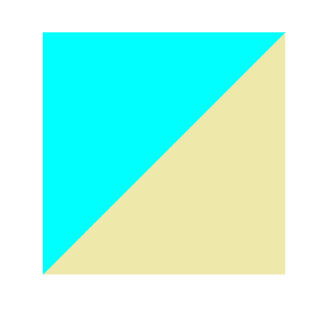
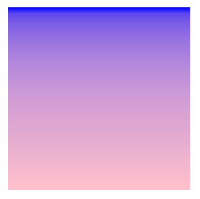

---
categories:
    - CSS
tags:
    - CSS
    - 学习笔记
    - 渐变
---

# CSS渐变

CSS渐变`<image>`类型的一种特殊类型`<gradient>`表示，由两种或多种颜色之间的渐进过渡组成。有三种类型的渐变：
- 线性（由`linear-gradient()`函数创建）
- 径向（由`radial-gradient()`函数创建）
- 圆锥（由`conic-gradient()`函数创建）

还可以使用`repeating-linear-gradient`和`repeating-radial-gradient`函数创建重复渐变

渐变可以在任何使用`<image>`的地方使用，例如在背景中。由于渐变是动态生成的，因此它们可以消除对传统用于实现类似效果的栅格图像文件的需求。此外，由于渐变是由浏览器生成的，因此在放大时它们看起来比栅格图像更好，并且可以动态调整大小。

## 线性渐变

### 基础线性渐变

指定的颜色被称为**色标**，可指定两个或多个色标。

```css
.simple-linear {
    background: linear-gradient(blue, pink);
}
```

### 改变渐变方向

默认情况下，线性渐变的方向是从上到下，可以指定一个值来改变渐进方向。

```css
.horizontal-gradient {
    background: linear-gradient(to right, blue, park);
}
```

### 对角线性渐变

可以设置渐变方向从一个对角到另一个对角。

```css
.diagonal-gradient {
    background: linear-gradient(to bottom right, blue, pink);
}
```

### 设置渐变角度

通过设置一个具体的角度来更精确的控制渐变方向。

```css
.angled-gradient {
    background: linear-gradient(70deg, blue, pink);
}
```

在使用角度的时候，`0deg`代表渐变方向从上到下，`90deg`代表渐变方向从左至右，诸如此类正角度都属于顺时针方向。而负角度意味着逆时针方向。


### 颜色终止位置

可以通过给每个颜色设置0， 1%或者2%或者其它的绝对数值来调整它们的位置。如果将位置设置为百分数，0%表示起始点，而100%表示终点，但是如果需要的话你也可以设置这个范围之外的其它值来达到想要的效果。如果有些位置你没有明确设置，那么它会被自动计算，第一种颜色会在0%处停止，而最后一种颜色是100%，至于其它颜色则是在它邻近的两种颜色的中间停止。

```css
.multicolor-linear {
    background: linear-gradient(to left, lime 28px, red 77%, cyan);
}
```

### 创建实线

要在两种颜色之间创建一条硬线，即创建一个条纹而不是逐渐过渡，可以将相邻的颜色停止设置为相同的位置。在此示例中，两种颜色在50%标记处共享一个颜色停止点，即渐变的一半：

```css
.striped {
    background: linear-gradient(to bottom left, cyan 50%, palegoldenrod 50%);
}
```


### 渐变提示

默认情况下，渐变会平滑地从一种颜色过渡到另一种颜色。可以通过设置一个值来将渐变的中心点移动到指定位置。如下例中，我们将渐变的中心点由50%设为10%:

```css
.color-hint {
    background: linear-gradient(blue, 10%, pink);
}
```
