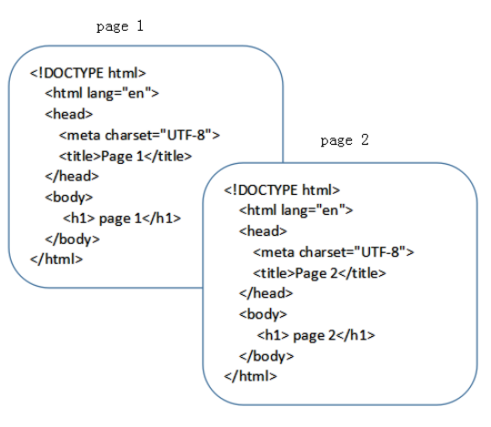
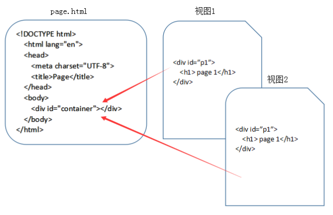

---
categories:
    - HTML
tags:
    - 面试
    - 路由
    - 学习笔记
---

# history和hash两种路由

## 什么是SPA

SPA 是 single page web application 的简称，译为单页Web应用。
简单的说 SPA 就是一个WEB项目只有一个 HTML 页面，一旦页面加载完成，SPA 不会因为用户的操作而进行页面的重新加载或跳转。 取而代之的是利用 JS 动态的变换 HTML 的内容，从而来模拟多个视图间跳转。

## 从传统页面到视图

在传统的网站设计中，每个HTML文件都是一个完成的HTML页面，涵盖了完整的HTML结构。

在 SPA 的应用设计中，一个应用只有一个HTML文件，在HTML文件中包含一个占位符（即图中的 container），占位符对应的内容由每个视图来决定，对于 SPA 来说，页面的切换就是视图之间的切换。

## 前端路由的由来

最开始的网页是多页面的，直到 Ajax 的出现，才慢慢有了 SPA。

SPA 的出现大大提高了 WEB 应用的交互体验。在与用户的交互过程中，不再需要重新刷新页面，获取数据也是通过 Ajax 异步获取，页面显示变的更加流畅。

但由于 SPA 中用户的交互是通过 JS 改变 HTML 内容来实现的，页面本身的 url 并没有变化，这导致了两个问题：

1. SPA 无法记住用户的操作记录，无论是刷新、前进还是后退，都无法展示用户真实的期望内容。
2. SPA 中虽然由于业务的不同会有多种页面展示形式，但只有一个 url，对 SEO 不友好，不方便搜索引擎进行收录。

前端路由就是为了解决上述问题而出现的。

作者：云中桥
链接：https://juejin.cn/post/6844903890278694919
来源：掘金
著作权归作者所有。商业转载请联系作者获得授权，非商业转载请注明出处。
