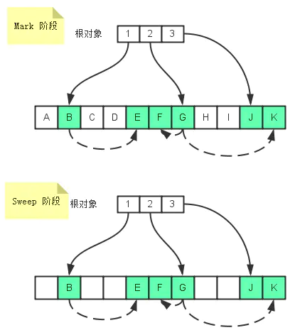
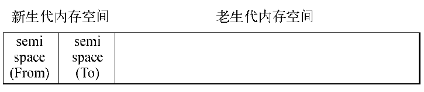
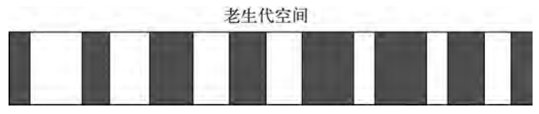
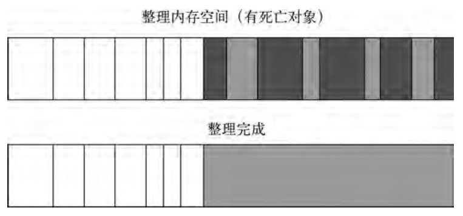

---
categories:
    - 面试
tags:
    - 面试
    - 学习笔记
    - 垃圾回收机制
---

# 垃圾回收机制

JavaScript具有自动垃圾收集机制(GC:GarbageCollection)，也就是说，执行环境会负责管理代码执行过程中使用的内存。开发人员不用再关心内存使用问题，所需内存的分配以及无用内存的回收完全实现了自动管理。

## 内存生命周期

JS环境中分配的内存一般有如下生命周期：
1. 内存分配：当我们声明变量、函数、对象，并执行的时候，系统会自动为他们分配内存。
2. 内存使用：即读写内存，也就是使用变量、函数等。
3. 内存回收：使用完毕，由垃圾回收机制自动回收不再使用的内存。

## 垃圾回收机制策略

### 标记清除算法

JavaScript中最常用的垃圾收集方式是标记清除（mark-and-sweep）。

这个算法把“对象是否不再需要”简化定义为“对象是否可以获得”。

该算法假定设置一个叫做根（root）的对象（在JavaScript里，根是全局对象）。垃圾回收器将**定期**从根开始扫描内存中的对象。凡是能从根部到达的对象，都是还需要使用的。那些无法由根部出发触及到的对象被标记为不再使用，稍后进行回收。

此算法可以分为两个阶段，一个是标记阶段（mark），一个是清除阶段（sweep）。

1. 标记阶段：垃圾回收器会从根对象开始遍历，每一个可以从根对象访问到的对象都会被添加一个标识，于是这个对象就被标识为可到达的对象。
2. 清除阶段：垃圾回收器会对堆内存从头到尾进行线性遍历，如果发现有对象没有被标识为可到达对象，那么就将此对象占用的内存回收，并且将原来标记为可到达对象的标识清除，以便进行下一次垃圾回收操作。



在标记阶段：从根对象1可以访问到B，从B又可以访问到E，那么B和E都是可到达对象，同样的道理，F、G、J和K都是可到达对象。

在回收阶段：所有未标记为可到达的对象都会被垃圾回收器回收。

**何时开始垃圾回收？**

通常来说，在使用标记清除算法时，未引用对象不会被立即回收。取而代之的做法是，垃圾对象将一直累计到内存耗尽为止。当内存耗尽时，程序将会被挂起，垃圾回收开始执行。

补充: 从2012年起，所有现代浏览器都使用了标记-清除垃圾回收算法。所有对JavaScript垃圾回收算法的改进都是基于标记-清除算法的改进，并没有改进标记-清除算法本身和它对“对象是否不再需要”的简化定义。

**标记清除算法缺陷**
- 那些无法从根对象查询到的对象都将被清除。
- 垃圾收集后有可能会造成大量的内存碎片，像上面的图片所示，垃圾收集后内存中存在三个内存碎片，假设一个方格代表1个单位的内存，如果有一个对象需要占用3个内存单位的话，那么就会导致Mutator（应用程序）一直处于暂停状态，而Collector一直在尝试进行垃圾收集，直到Out of Memory。
- 回收效率不高(需要进行两次内存扫描，分别是标记阶段和清除阶段)。

### 引用计数算法

这是最初级的垃圾收集算法.现在已经没有浏览器会用这种算法.

此算法把“对象是否不再需要”简化定义为“对象有没有其他对象引用到它”。如果没有引用指向该对象（零引用），对象将被垃圾回收机制回收。

引用计数的含义是跟踪记录每个值被引用的次数。当声明了一个变量并将一个引用类型值赋给该变量时，则这个值的引用次数就是1。如果同一个值又被赋给另一个变量，则该值的引用次数加1。相反，如果包含对这个值引用的变量又取得了另外一个值，则这个值的引用次数减1。当这个值的引用次数变成0时，则说明没有办法再访问这个值了，因而就可以将其占用的内存空间回收回来。这样，当垃圾收集器下次再运行时，它就会释放那些引用次数为零的值所占用的内存。

**引用计数缺陷**

该算法有个限制：无法处理循环引用。如果两个对象被创建，并互相引用，形成了一个循环。它们被调用之后会离开函数作用域，所以它们已经没有用了，可以被回收了。然而，引用计数算法考虑到它们互相都有至少一次引用，所以它们不会被回收。

## Chrome V8 垃圾回收算法

Chrome 浏览器所使用的 V8 引擎就是采用的分代回收策略。这个和 Java 回收策略思想是一致的。目的是通过区分「临时」与「持久」对象；多回收「临时对象区」（新生代younggeneration），少回收「持久对象区」（老生代 tenured generation），减少每次需遍历的对象，从而减少每次GC的耗时。

### V8的内存限制

在node中javascript能使用的内存是有限制的.
> 64位系统下约为1.4GB。
>
> 32位系统下约为0.7GB。

对应到分代内存中，默认情况下。

> 32位系统新生代内存大小为16MB，老生代内存大小为700MB。
>
> 64位系统下，新生代内存大小为32MB，老生代内存大小为1.4GB。

新生代平均分成两块相等的内存空间，叫做semispace，每块内存大小8MB（32位）或16MB（64位）。

这个限制在node启动的时候可以通过传递--max-old-space-size 和 --max-new-space-size来调整，如：

```js
node --max-old-space-size=1700 app.js //单位为MB
node --max-new-space-size=1024 app.js //单位为kb
```

上述参数在V8初始化时生效，一旦生效就不能再动态改变。

**内存限制的原因**

至于V8为何要限制堆的大小，表层原因：V8最初为浏览器而设计，不太可能遇到用大量内存的场景。深层原因：V8的垃圾回收机制的限制。官方说法，以1.5GB的垃圾回收堆内存为例，V8做一次小的垃圾回收需要50毫秒以上，做一次非增量式的垃圾回收甚至要1秒以上。这是垃圾回收中引起JS线程暂停执行的时间，在这样时间花销下，应用的性能和响应能力都会直线下降。

### V8的分代回收（Generation GC）

V8垃圾回收策略主要基于分代式垃圾回收机制。现代的垃圾回收算法中按对象的存活时间将内存的垃圾回收进行不同的分代，然后分别对不同分代的内存施以更高效的算法。

V8的内存分代:

在V8中，主要将内存分为新生代和老生代，新生代内存 存储的为存活时间较短的对象，老生代内存 存储的为存活时间较长或常驻内存的对象，如下图：



V8堆的整体大小就是新生代所用内存空间加上老生代的内存空间。

#### V8新生代算法（Scavenge）

在分代基础上，新生代中的对象主要通过Scavenge算法进行垃圾回收。在Scavenge的具体实现中，主要采用了Cheney算法

Cheney算法是一种采用复制的方式实现的垃圾回收算法。它将堆内存一分为二，每一部分空间称为semi space。在这两个semi space空间中，只有一个处于使用中，另一个处于闲置状态。处于使用状态的semi space空间称为From空间，处于闲置状态的空间称为To空间。

当我们分配对象时，先是在From空间中进行分配。当开始进行垃圾回收时，会检查From空间中的存活对象，这些存活对象将被复制到To空间中，而(From空间内的)非存活对象占用的空间将会被释放。完成复制后，From空间和To空间的角色发生对换(即以前的From空间释放后变为To;To空间在复制存活的对象后,变为From空间)。简而言之，在垃圾回收过程中，就是通过将存活对象在两个semispace空间之间进行复制。

**Scavenge的缺点:**

只能使用堆内存中的一半，这是由划分空间和复制机制所决定的。

**Scavenge的优点:**

Scavenge由于只复制存活的对象，并且对于生命周期短的场景存活对象只占少部分，所以它在时间效率上有优异的表现。 Scavenge是典型的牺牲空间换取时间的算法， 所以无法大规模地应用到所有的垃圾回收中。但可以发现，Scavenge非常适合应用在新生代中，因为新生代中对象的生命周期较短，恰恰适合这个算法。

**晋升:**

实际使用的堆内存是新生代的两个semi space空间大小和老生代所用内存大小之和。当一个对象经过多次复制依然存活时，它将会被认为是生命周期较长的对象。这种较长生命周期的对象随后会被移动到老生代中，采用新的算法进行管理。对象从新生代中移动到老生代中的过程称为晋升。

在单纯的Scavenge过程中，From空间中的存活对象会被复制到To空间中去，然后对From空间和To空间进行角色对换（又称翻转）。但在分代式垃圾回收前提下，From空间中的存活对象在复制到To空间之前需要进行检查。在一定条件下，需要将存活周期长的对象移动到老生代中，也就是完成对象晋升。

**晋升条件:**

对象晋升的条件主要有两个，一个是对象是否经历过Scavenge回收，一个是To空间的内存占用比超过25%限制。

**设置25%这个限制值的原因:**

当这次Scavenge回收完成后，这个To空间将变成From空间，接下来的内存分配将在这个空间中进行。如果占比过高，会影响后续的内存分配。 对象晋升后，将会在老生代空间中作为存活周期较长的对象来对待，接受新的回收算法处理。

#### V8老生代算法（Mark-Sweep && Mark-Compact）

> 对于老生代中的对象，由于存活对象占较大比重，再采用Scavenge的方式会有两个问题：一个是存活对象较多，复制存活对象的效率将会很低；另一个问题依然是浪费一半空间的问题。为此，V8在老生代中主要采用Mark-Sweep和Mark-Compact相结合的方式进行垃圾回收。

**Mark-Sweep:**

Mark-Sweep是标记清除的意思，它分为标记和清除两个阶段。与Scavenge相比，Mark-Sweep并不将内存空间划分为两半，所以不存在浪费一半空间的行为。与Scavenge复制活着的对象不同，Mark-Sweep在标记阶段遍历堆中所有对象，并标记活着的对象，在随后的清除阶段中，只清除没有被标记的对象。 可以看出，Scavenge中只复制活着的对象，而Mark-Sweep只清理死亡对象。 活对象在新生代中只占较小部分，死对象在老生代中只占较小部分，这是两种回收方式能高效处理的原因。


**Mark-Sweep最大的问题:**

在进行一次标记清除回收后，内存空间会出现不连续的状态。这种内存碎片会对后续的内存分配造成问题，因为很可能出现需要分配一个大对象的情况，这时所有的碎片空间都无法完成此次分配，就会提前触发垃圾回收，而这次回收是不必要的。(注意理解这句话,不要把内存想象成液体.而是固体,就像一个个散乱排列的麻将,需要进行排序处理--即后面要讲的 Mark-Compact)

**Mark-Compact:**

为了解决Mark-Sweep的内存碎片问题，Mark-Compact被提出来。Mark-Compact是标记整理的意思，是在Mark-Sweep的基础上演变而来的。它们的差别在于对象在标记为死亡后，在整理的过程中，将活着的对象往一端移动，移动完成后，直接清理掉边界外的内存。 下图为Mark-Compact完成标记并移动存活对象后的示意图，白色格子为存活对象，深色格子为死亡对象，浅色格子为存活对象移动后留下的空洞。



完成移动后，就可以直接清除最右边的存活对象后面的内存区域完成回收。

Mark-Sweep、Mark-Compact、Scavenge三种主要垃圾回收算法的简单对比：
|回收算法|Mark-Sweep|Mark-Compact|Scavenge|
|---|---|---|---|
|速度|中等|最慢|最快|
|空间开销|少（有碎片）|少（无碎片）|双倍空间（无碎片）|
|是否移动对象|否|是|是|

从表格上看，Mark-Sweep和Mark-Compact之间，由于Mark-Compact需要移动对象，所以它的执行速度不可能很快，所以在取舍上，V8主要使用Mark-Sweep，在空间不足以对从新生代中晋升过来的对象进行分配时才使用Mark-Compact。

### 增量式标记回收(Incremental Marking):

- 为了避免出现js应用逻辑与垃圾回收器看到的不一致的情况，垃圾回收的3种基本算法都需要将应用逻辑暂停下来，待执行完垃圾回收后再恢复执行应用逻辑，这种行为被称为“全停顿”（stop-the-world）。在V8的分代式垃圾回收中，一次小垃圾回收只收集新生代，由于新生代默认配置得较小，且其中存活对象通常较少，所以即便它是全停顿的影响也不大。但V8的老生代通常配置得较大，且存活对象较多，全堆垃圾回收（full垃圾回收）的标记、清理、整理等动作造成的停顿就会比较可怕，需要设法改善(PS: 若V8的堆内存为1.5GB，V8做一次小的垃圾回收需要50ms以上，做一次非增量式的垃圾回收甚至要1秒以上。)。
- 为了降低全堆垃圾回收带来的停顿时间，V8先从标记阶段入手，将原本要一口气停顿完成的动作改为增量标记（incremental marking），也就是拆分为许多小“步进”，每做完一“步进”就让js应用逻辑执行一小会，垃圾回收与应用逻辑交替执行直到标记阶段完成。
- V8在经过增量标记的改进后，垃圾回收的最大停顿时间可以减少到原本的1/6左右。
- V8后续还引入了延迟清理（lazy sweeping）与增量式整理（incremental compaction），让清理与整理动作也变成增量式的。同时还计划引入并行标记与并行清理，进一步利用多核性能降低每次停顿的时间。

### 减少垃圾和回收对性能的影响:

- 让垃圾回收尽量少地进行，尤其是全堆垃圾回收。主要靠v8自己的优化机制.
- 避免内存泄露,让内存及时得到释放。这部分是我们需要注意的