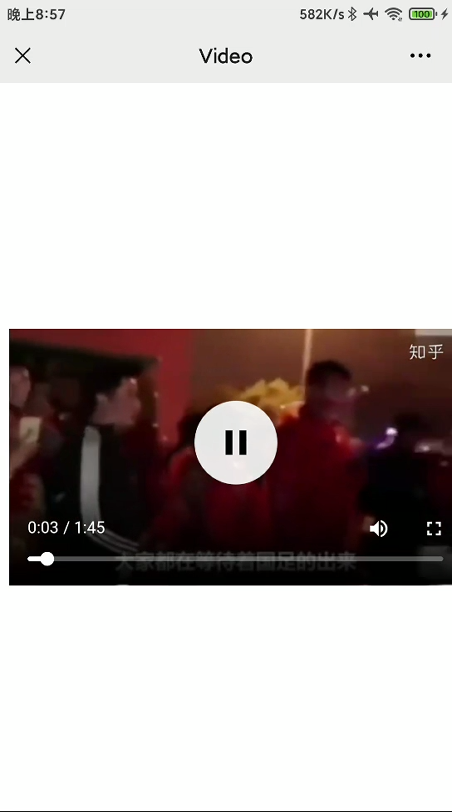

---
categories:
    - 微信的坑
tags:
    - 视频播放
---

# 微信内置X5内核浏览器播放视频相关问题

[官网](https://x5.tencent.com/docs/video.html)

## 原生`video`标签

```html
  <video id="vid" src="./assets/test.mp4" poster="./assets/test.png" controls></video>
```


## X5内核视频两种播放形态

1. 页面内播放

X5内核视频在用户点击后默认会进入全屏播放，前端可以设置video的`x5-playsinline`属性来将视频限定于网页内部播放

```html
  <video id="vid" src="./assets/test.mp4" poster="./assets/test.png" controls x5-playsinline></video>
```


2. 同层页面内播放

同层页面内播放是标准的视频播放形态，在video标签中添加且只需要添加一个(不要与`x5-playsinline`同时存在):`x5-video-player-type='h5-page'`属性来控制网页内部同层播放，可以在视频上方显示html元素。

```html
  <video id="vid" src="./assets/test.mp4" poster="./assets/test.png" controls x5-video-player-type="h5-page"></video>
```



