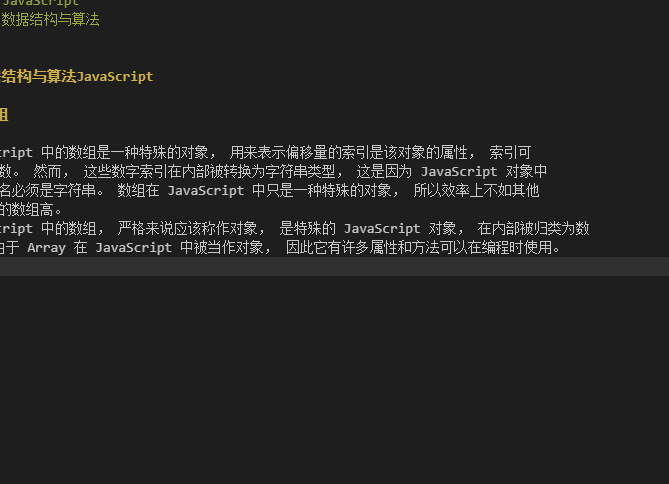

---
categories:
    - 数据结构与算法
tags:
    - JavaScript
    - 数据结构与算法
---

# 数据结构与算法JavaScript

## 数组

JavaScript 中的数组是一种特殊的对象， 用来表示偏移量的索引是该对象的属性， 索引可
能是整数。 然而， 这些数字索引在内部被转换为字符串类型， 这是因为 JavaScript 对象中
的属性名必须是字符串。 数组在 JavaScript 中只是一种特殊的对象， 所以效率上不如其他
语言中的数组高。
JavaScript 中的数组， 严格来说应该称作对象， 是特殊的 JavaScript 对象， 在内部被归类为数
组。 由于 Array 在 JavaScript 中被当作对象， 因此它有许多属性和方法可以在编程时使用。

